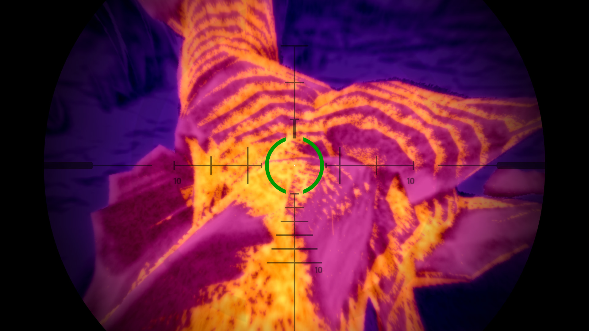

# IntoMuddyWaters
A mod for GTA V that investigates the in-game legend of the swamp monster.

MOD TRAILER:
- https://youtu.be/KaB79IyEzig

INSTALLATION:
- Copy "intoMuddyWaters.dll" and the "audioEssay" folder into your scripts folder (if you don't have one, create it) in your GTA V root folder.

USAGE:
- press H to activate the mod
- note: once the mod is activated, it cannot be turned off until the essay is over

REQUIREMENTS:
- Script Hook V
- Script Hook V Dot Net

